# Project – Build a Linux System Monitor Using Bash


---

## Overview

This project demonstrates how to build a **Linux system monitor using a Bash shell script**. The monitor continuously tracks **CPU, memory, and disk usage** in real time and fires color-coded alerts in the terminal whenever any resource exceeds a configurable threshold. Completed on the **LabEx** platform inside a browser-based VS Code environment running Linux.

This project is directly applicable to roles in **IT Operations**, **DevOps**, **Linux Administration**, and **SOC/Cybersecurity** where system health awareness is essential.

---

## Environment

| Tool | Purpose |
|------|---------|
| LabEx (labex.io) | Browser-based Linux lab environment |
| VS Code (in-browser) | Code editor and integrated terminal |
| Bash | Shell scripting language |
| Linux Commands (`top`, `free`, `df`, `awk`) | Resource data collection |
| `chmod` | Setting script execution permissions |

---

## Script Overview – `system_monitor.sh`

The script is organized into three main sections, each handling a different system resource, plus a `while true` loop that continuously runs all checks.

| Section | Command Used | Purpose |
|---------|-------------|---------|
| Alert Function | `tput setaf 1` / `tput sgr0` | Prints color-coded red alert messages |
| CPU Monitor | `top -bn1` + `grep` + `awk` | Reads and parses real-time CPU usage |
| Memory Monitor | `free` + `awk` | Calculates memory usage as a percentage |
| Disk Monitor | `df -h /` + `awk` | Reads root partition disk usage |
| Continuous Loop | `while true; do` | Keeps monitoring running indefinitely |

---

## Build Steps

---

### Step 1 – Create and Prepare the Script File

Navigated to the project directory, created the script file, and granted it execute permissions.

```bash
cd ~/project
touch system_monitor.sh
chmod +x system_monitor.sh
```

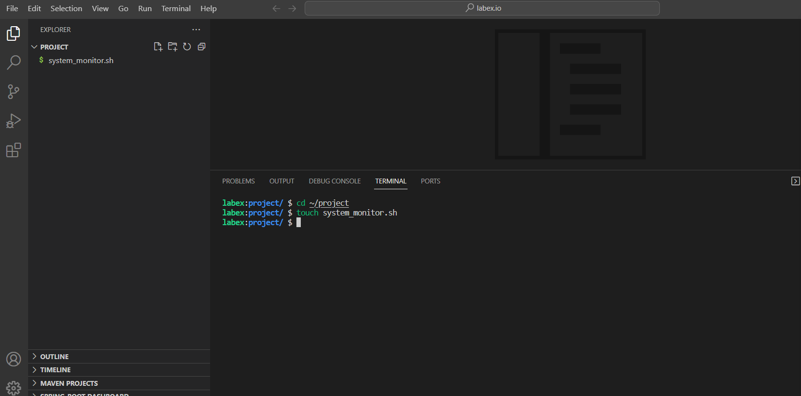
*VS Code terminal — script file created and chmod +x applied; system_monitor.sh appears in the Explorer panel*

---

### Step 2 – Write the Alert Function

The `send_alert()` function takes a resource name and current value as arguments and prints a red-colored alert using `tput`. This was the first function written and tested independently.

```bash
# Function to send an alert
send_alert() {
    echo "$(tput setaf 1)ALERT: $1 usage exceeded threshold! Current value: $2%$(tput sgr0)"
}

send_alert "CPU" 85
```

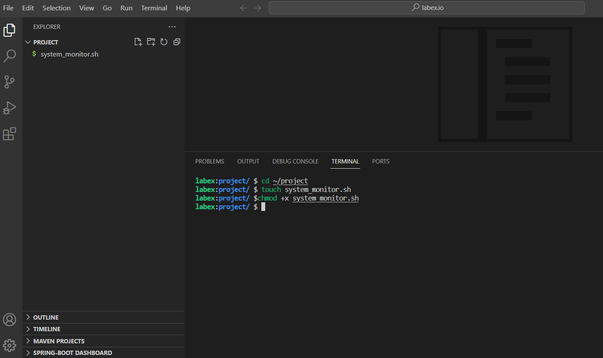
*system_monitor.sh — send_alert() function written with test call for CPU at 85%*

---

### Step 3 – Test the Alert Function

Ran the script to confirm the alert function fires correctly and outputs a red-colored alert message to the terminal.

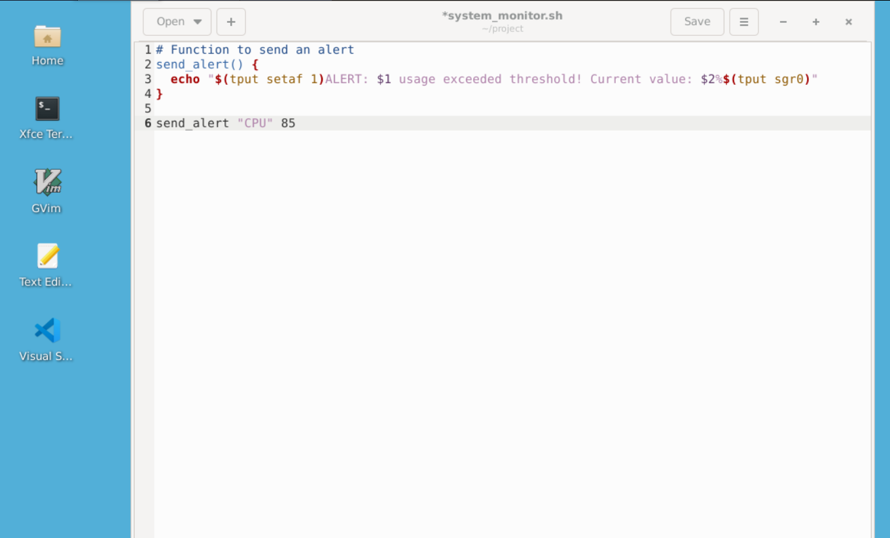
*Terminal output — `ALERT: CPU usage exceeded threshold! Current value: 85%` displayed in red*

---

### Step 4 – Add CPU Monitoring Logic

Added the CPU monitoring block using `top -bn1`, parsed with `grep` and `awk` to extract the combined user + system CPU percentage. An `if` statement compares the value against `CPU_THRESHOLD` and triggers the alert function if exceeded.

```bash
# Monitor CPU usage
cpu_usage=$(top -bn1 | grep "Cpu(s)" | awk '{print $2 + $4}')
cpu_usage=${cpu_usage%.*}  # Convert to integer
echo "Current CPU usage: $cpu_usage%"

if ((cpu_usage >= CPU_THRESHOLD)); then
    send_alert "CPU" "$cpu_usage"
fi
```

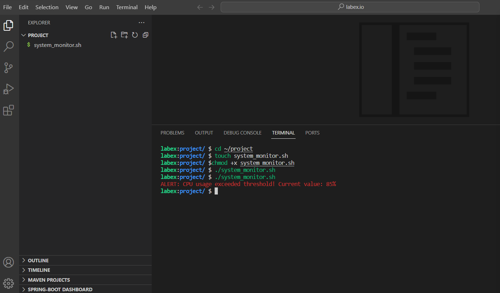
*system_monitor.sh — CPU monitoring block added with threshold check and send_alert call*

---

### Step 5 – Add Memory Monitoring Logic

Extended the script with memory monitoring using the `free` command piped through `awk` to calculate memory usage as a percentage of total RAM.

```bash
# Monitor memory usage
memory_usage=$(free | awk '/Mem/ {printf("%3.1f", ($3/$2) * 100)}')
echo "Current memory usage: $memory_usage%"
memory_usage=${memory_usage%.*}
if ((memory_usage >= MEMORY_THRESHOLD)); then
    send_alert "Memory" "$memory_usage"
fi
```

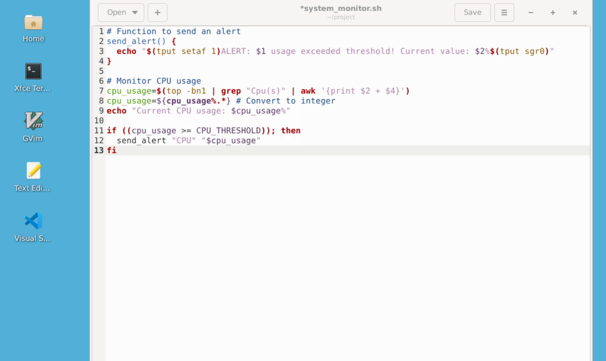
*system_monitor.sh — memory monitoring block added below CPU section*

---

### Step 6 – Add Disk Monitoring Logic

Added disk usage monitoring using `df -h /` to check the root partition, with `awk` extracting the usage percentage and stripping the `%` sign for the comparison.

```bash
# Monitor disk usage
disk_usage=$(df -h / | awk '/\// {print $(NF-1)}')
disk_usage=${disk_usage%?}  # Remove the % sign
echo "Current disk usage: $disk_usage%"

if ((disk_usage >= DISK_THRESHOLD)); then
    send_alert "Disk" "$disk_usage"
fi
```

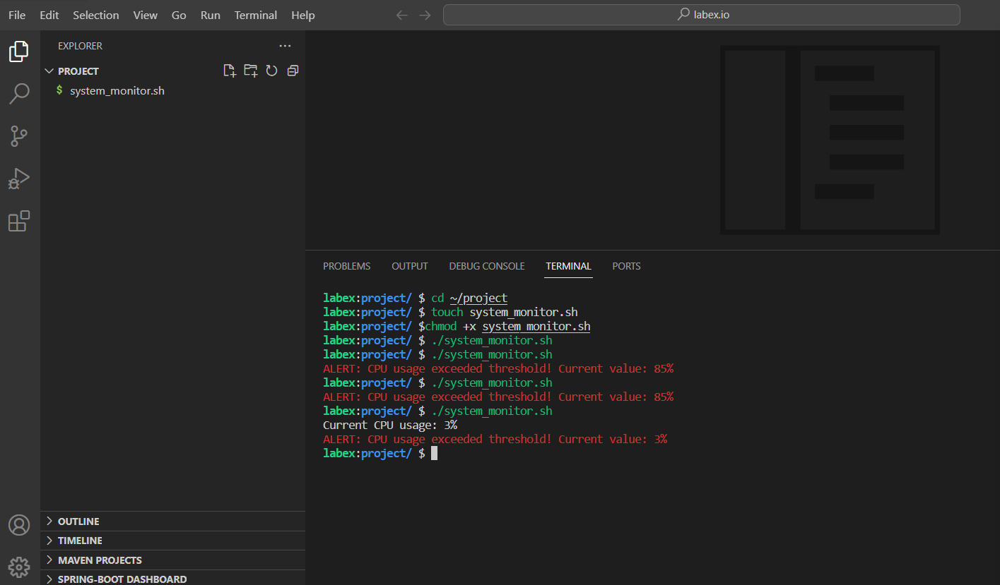
*system_monitor.sh — full script showing CPU, memory, and disk monitoring blocks*

---

### Step 7 – Add the Continuous Loop and Display Block

Wrapped all monitoring logic in a `while true; do` loop and added a `clear` + `echo` display block to continuously refresh resource stats in the terminal.

```bash
while true; do
    # Monitor CPU
    ...
    # Monitor memory
    ...
    # Monitor disk
    ...
    # Display current stats
    clear
    echo "Resource Usage:"
    echo "CPU: $cpu_usage%"
    echo "Memory: $memory_usage%"
    echo "Disk: $disk_usage%"
done
```

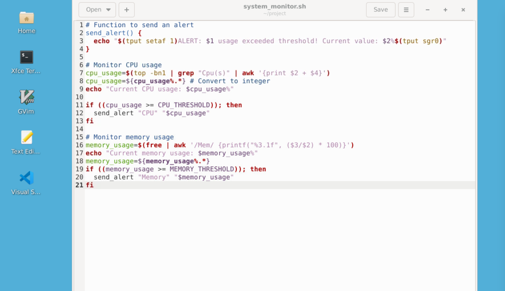
*system_monitor.sh — complete script with while loop, all three monitors, and display block (lines 32–57)*

---

## Script Output & Testing

---

### CPU and Memory Alerts Firing

After completing the CPU and memory sections, running the script confirmed both alert types fire correctly in the terminal with red-colored output.

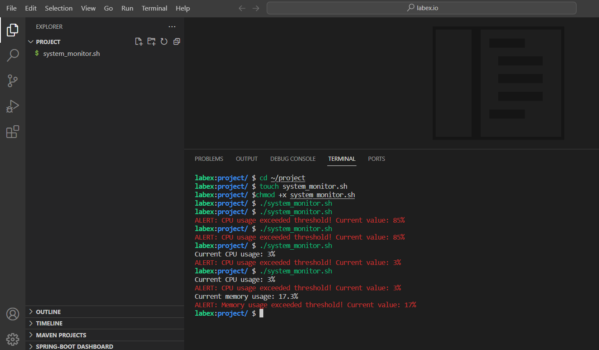
*Terminal — multiple runs showing CPU (3%) and Memory (17%) alerts firing simultaneously*

---

### All Three Alerts Firing (CPU, Memory, Disk)

With the full script complete, all three monitors trigger alerts across repeated runs, confirming the disk monitoring block works alongside CPU and memory.

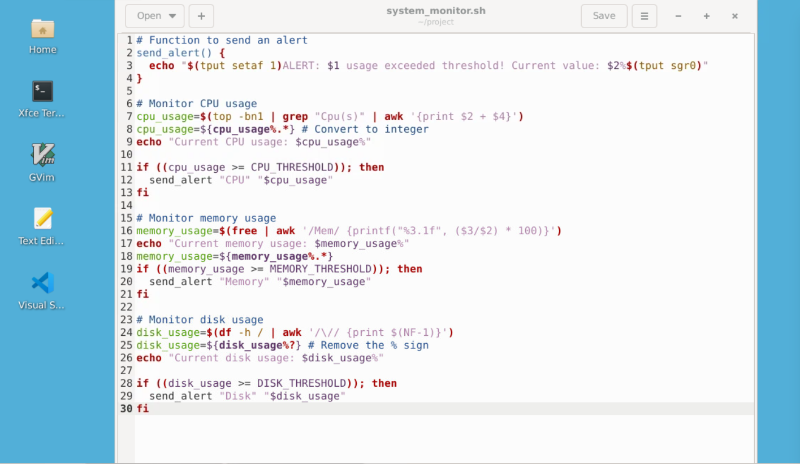
*Terminal — CPU (4%), Memory (17%), and Disk (1%) alerts all firing in a single script run*

---

### Final Clean Dashboard Output

The final version of the script uses `clear` and `echo` to display a clean resource usage summary before checking thresholds, providing a readable dashboard view.

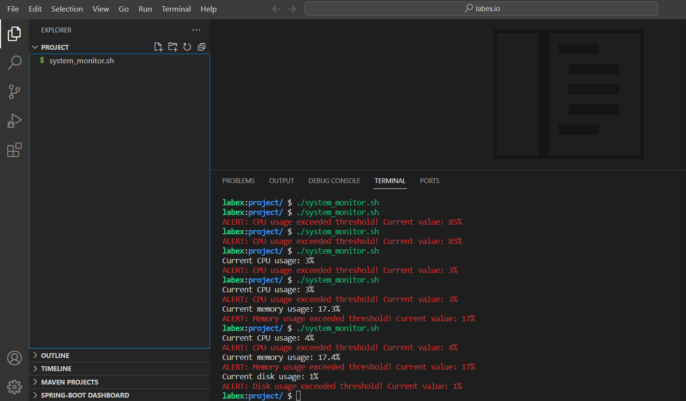
*Terminal — clean "Resource Usage" display showing CPU: 8%, Memory: 17%, Disk: 1%*

---

### Full Terminal Run History

A full view of the terminal across multiple script executions, showing the progression from early CPU-only alerts to the complete three-resource monitor with real-time output.

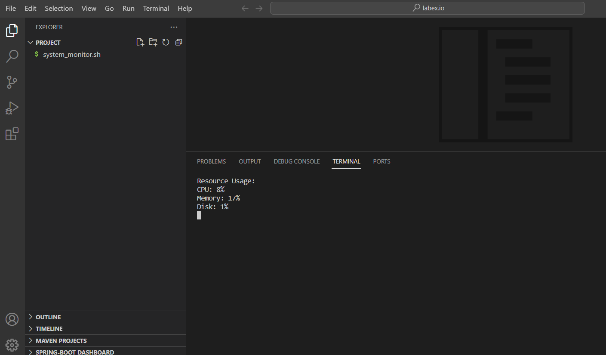
*Terminal — full run history showing iterative testing across all three resource monitors*

---

## Skills Demonstrated

| Skill | How It Was Applied |
|-------|--------------------|
| Bash Scripting | Wrote a complete multi-function shell script from scratch |
| Linux System Commands | Used `top`, `free`, `df`, `grep`, and `awk` to collect resource data |
| Functions in Bash | Created a reusable `send_alert()` function with parameters |
| Conditional Logic | Used `if` statements and arithmetic comparisons for threshold checks |
| Loops | Implemented a `while true` loop for continuous monitoring |
| Text Parsing with `awk` | Extracted and formatted numeric values from command output |
| Terminal Formatting | Used `tput` to colorize alert output in red |
| File Permissions | Applied `chmod +x` to grant execute permission to the script |
| Iterative Development | Built and tested the script incrementally, one resource at a time |

---

## Lessons Learned

**Piping commands together is a core Linux skill.** Chaining `top`, `grep`, and `awk` to extract a single clean number from messy system output is a pattern that shows up constantly in Linux automation and log parsing. Practicing it here builds real comfort with the command line.

**Threshold-based alerting is the foundation of monitoring.** Whether you're writing a Bash script or configuring a SIEM like Splunk, the core idea is the same: define a baseline, measure against it, and trigger an action when it's exceeded. This project shows that concept at the script level.

**Iterative building and testing beats writing everything at once.** Each section was written, saved, and run before moving to the next — which made debugging much easier. This mirrors professional development habits in both scripting and software engineering.

---

## References

- [LabEx – Build a Linux System Monitor Using Bash](https://labex.io)
- [GNU Bash Manual](https://www.gnu.org/software/bash/manual/)
- [Linux `top` Command Documentation](https://man7.org/linux/man-pages/man1/top.1.html)
- [Linux `free` Command Documentation](https://man7.org/linux/man-pages/man1/free.1.html)
- [Linux `df` Command Documentation](https://man7.org/linux/man-pages/man1/df.1.html)
